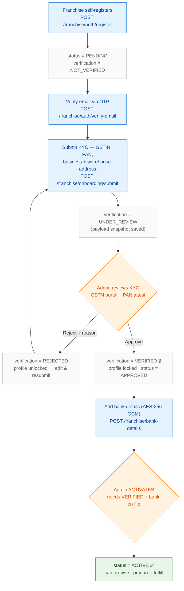
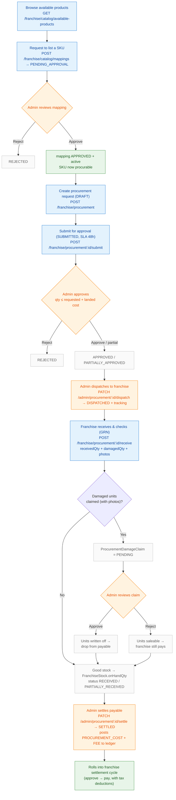
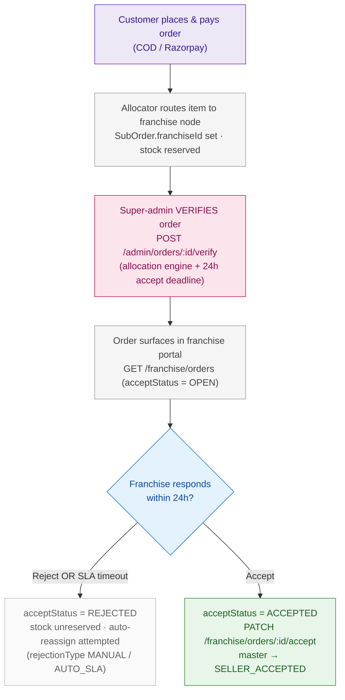
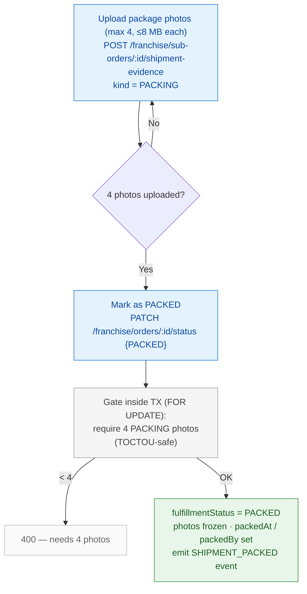
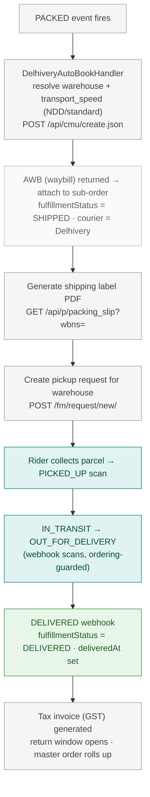
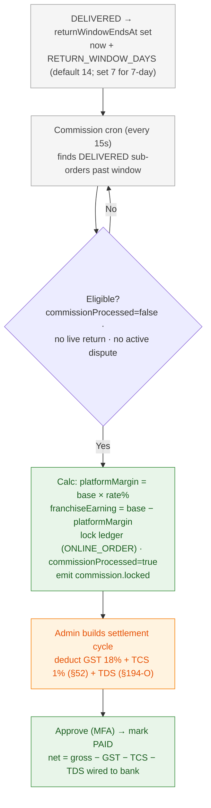
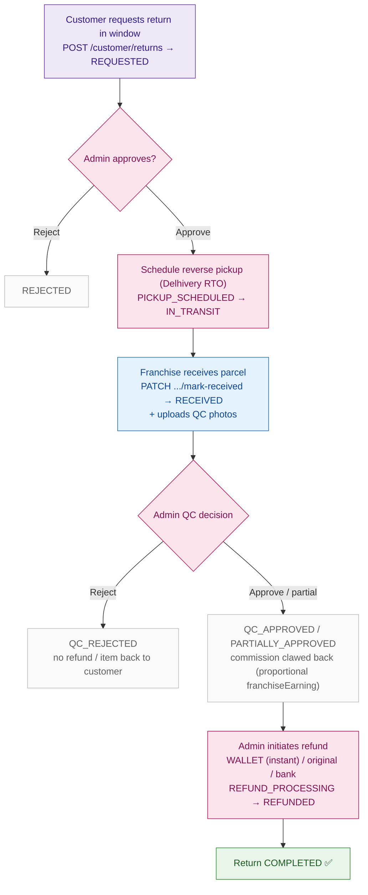

# Franchise Lifecycle — End-to-End Flow Chart

> Mapped from the actual codebase (NestJS API + `web-franchise` portal + `logistics-facade` Delhivery integration).
> Render the Mermaid blocks on GitHub, in VS Code (Markdown Preview Mermaid), or at https://mermaid.live.

## Two important reality-checks vs. the verbal description
1. **"Super admin accepts the order"** is actually the **order *verification*** step (`POST /admin/orders/:id/verify`, perm `orders.verify`). Verification runs the allocator, routes the sub-order to the franchise, and starts the 24h accept clock. The franchise then does the real *accept*.
2. **"7-day commission"** — the code locks commission after `returnWindowEndsAt`, driven by env `RETURN_WINDOW_DAYS` whose **default is 14 days** (not 7). "7 days" is the business intent; set `RETURN_WINDOW_DAYS=7` to match. Same window governs return eligibility.
3. In returns, **approve / QC / refund are admin (franchise-scoped admin via `/admin/franchise-returns/*`)**; the franchise *owner* portal only gets read + mark-received + upload-QC-evidence.

---

## 0 · Overview (the spine)

```mermaid
flowchart LR
    O1["**1 Onboarding**<br/>register → KYC → approve → ACTIVE"] --> O2["**2 Catalog + Procurement**<br/>stock the franchise"]
    O2 --> O3["**3 Customer Order**<br/>verify → route → accept"]
    O3 --> O4["**4 Fulfillment**<br/>4 photos → PACKED"]
    O4 --> O5["**5 Delhivery**<br/>auto-book → pickup → deliver"]
    O5 --> O6["**6 Commission**<br/>locked after return window"]
    O6 --> O7["**7 Returns**<br/>within window (optional)"]
    classDef p fill:#eef4ff,stroke:#3b6fd4,color:#13316b,font-weight:bold;
    class O1,O2,O3,O4,O5,O6,O7 p;
```

---

## 1 · Registration & Admin Approval (onboarding)

**Steps:** register (PENDING) → email OTP → KYC submit (UNDER_REVIEW) → admin GSTN/PAN check → approve (VERIFIED, profile **locked**, APPROVED) → bank details → admin activate (**ACTIVE**).
**Gates:** email must be verified before KYC; GSTIN[0:2]=state, GSTIN[2:12]=PAN; PENDING→APPROVED needs VERIFIED + both tax IDs; APPROVED→ACTIVE needs bank details. Perm `franchise.approve`. Contract expiry later auto-flips ACTIVE→SUSPENDED (hourly cron).

---

## 2 · Catalog Browsing → Procurement → Receive → Settle (stocking the franchise)

**Procurement statuses:** `DRAFT → SUBMITTED → APPROVED / PARTIALLY_APPROVED / REJECTED → DISPATCHED → PARTIALLY_RECEIVED / RECEIVED → SETTLED` (+`CANCELLED` from DRAFT/SUBMITTED).
**Damage claim:** `PENDING → APPROVED` (written off, excluded from payable) `/ REJECTED` (saleable, still billed). Photo proof mandatory. Receipt is delta-idempotent (no double-stock on retry).

---

## 3 · Customer Order → Super-Admin Verify → Franchise Accept

**Accept SLA:** 24h from verification; a 5-min cron auto-rejects (`AUTO_SLA`) past deadline. Accept/reject is row-locked (`SELECT FOR UPDATE`) to race-guard the cron. Contract-expiry also blocks accept.

---

## 4 · Fulfillment — Upload 4 Images → Mark as PACKED

**Gate:** exactly 4 PACKING photos required to leave `UNFULFILLED → PACKED` (env `SHIPMENT_EVIDENCE_REQUIRED_PHOTOS`, default 4), counted inside the transaction. Photos frozen post-pack to prevent tampering; sub-order must be `ACCEPTED` first.

---

## 5 · Delhivery — Auto-Book → Label → Pickup → Delivered

**Auto-book** is triggered by the `PACKED` status-changed event (`delhivery-auto-book.handler.ts`); idempotent (skips if AWB exists). Webhook ingestion is IP-allowlisted + HMAC-verified + deduped on `(provider, eventKey)`. Out-of-order scans dropped via `lastTrackingEventAt` guard. *(One explorer flagged the PACKED→auto-book wiring as recently added — confirm it's enabled in your target env.)*

---

## 6 · Commission — Locked After the Return Window

**Ledger flow:** `PENDING → ACCRUED (commission locked) → SETTLED (paid)` (+`REVERSED` on return/void). Rate = per-franchise `onlineFulfillmentRate` (snapshotted on the order). "Your Earning" shown to franchise = net payable after GST+TCS+TDS.

---

## 7 · Returns Within the Window (optional branch)

**Return statuses:** `REQUESTED → APPROVED → PICKUP_SCHEDULED → IN_TRANSIT → RECEIVED → QC_APPROVED / PARTIALLY_APPROVED / QC_REJECTED → REFUND_PROCESSING → REFUNDED → COMPLETED` (+`REFUND_FAILED`, `CANCELLED`, dispute overrides). **Commission reversal happens at QC-approve time** (not refund), reverses *proportional franchiseEarning*, gated by `COMMISSION_REVERSAL_WINDOW_DAYS` (default 30 → otherwise held for next-cycle clawback). Refunds flow `RefundInstruction → RefundProcessor → WalletService`. Perms: `franchise.returns.manage`, `franchise.returns.refund`.

---

## Status reference

| Domain | Status values |
|---|---|
| **Franchise account** | PENDING · APPROVED · ACTIVE · SUSPENDED · DEACTIVATED |
| **KYC verification** | NOT_VERIFIED · UNDER_REVIEW · VERIFIED · REJECTED |
| **Catalog mapping** | PENDING_APPROVAL · APPROVED · REJECTED · STOPPED · SUSPENDED |
| **Procurement** | DRAFT · SUBMITTED · APPROVED · PARTIALLY_APPROVED · REJECTED · DISPATCHED · PARTIALLY_RECEIVED · RECEIVED · SETTLED · CANCELLED |
| **Damage claim** | PENDING · APPROVED · REJECTED |
| **Sub-order accept** | OPEN · ACCEPTED · REJECTED · CANCELLED |
| **Sub-order fulfillment** | UNFULFILLED · PACKED · SHIPPED · IN_TRANSIT · OUT_FOR_DELIVERY · DELIVERED · CANCELLED |
| **Master order** | PENDING_PAYMENT · PLACED · VERIFIED · ROUTED_TO_SELLER · SELLER_ACCEPTED · PARTIALLY_SHIPPED · DISPATCHED · PARTIALLY_DELIVERED · DELIVERED · PARTIALLY_CANCELLED · CANCELLED · EXCEPTION_QUEUE |
| **Finance ledger** | PENDING · ACCRUED · HOLD · SETTLED · REVERSED |
| **Franchise settlement** | PENDING · APPROVED · PAID · FAILED · ON_HOLD · PARTIALLY_PAID |
| **Settlement cycle** | DRAFT · PREVIEWED · APPROVED · READY_FOR_PAYOUT · PAID · CANCELLED |
| **Return** | REQUESTED · APPROVED · REJECTED · PICKUP_SCHEDULED · IN_TRANSIT · RECEIVED · QC_APPROVED · PARTIALLY_APPROVED · QC_REJECTED · REFUND_PROCESSING · REFUNDED · REFUND_FAILED · COMPLETED · CANCELLED · DISPUTE_* |

## Cross-cutting branches (not on the happy path)
- **Contract expiry** → hourly cron auto-flips ACTIVE→SUSPENDED; blocks *all* franchise transactions (procurement, POS, order accept).
- **Partial states** → PARTIALLY_SHIPPED / PARTIALLY_DELIVERED / PARTIALLY_CANCELLED master-order rollups for multi-node orders.
- **POS** → in-store sale, void (24h window), return, and end-of-day reconciliation (MATCHED/VARIANCE → admin approve).
- **Settlement holds** → ON_HOLD (compliance) and PARTIALLY_PAID (bank), plus cycle PREVIEW (dry-run) and CANCELLATION.

---

## Single end-to-end diagram (all 7 phases collapsed)

```mermaid
flowchart TD
  subgraph P1["1 · Onboarding & Admin Approval"]
    A1["Franchise registers<br/>POST /franchise/auth/register · PENDING"]
    A2["Verify email (OTP)"]
    A3["Submit KYC — GSTIN, PAN, addresses<br/>UNDER_REVIEW"]
    A4{"Admin reviews KYC<br/>GSTN + PAN"}
    A5["REJECTED — edit & resubmit"]
    A6["VERIFIED 🔒 profile locked · APPROVED"]
    A7["Add bank details (encrypted)"]
    A8{"Admin activates<br/>VERIFIED + bank"}
    A9["status = ACTIVE ✅"]
    A1-->A2-->A3-->A4
    A4-->|reject|A5-->A3
    A4-->|approve|A6-->A7-->A8-->A9
  end

  subgraph P2["2 · Catalog → Procurement → Receive → Settle"]
    B1["Browse catalog<br/>GET /franchise/catalog/available-products"]
    B2["List SKU → PENDING_APPROVAL"]
    B3{"Admin approves mapping"}
    B3r["REJECTED"]
    B4["Mapping APPROVED"]
    B5["Create procurement · DRAFT"]
    B6["Submit → SUBMITTED (SLA 48h)"]
    B7{"Admin approves<br/>qty + landed cost"}
    B7r["REJECTED"]
    B8["APPROVED / PARTIALLY_APPROVED"]
    B9["Admin dispatch → DISPATCHED + tracking"]
    B10["Franchise receives & checks (GRN)<br/>receivedQty + damagedQty + photos"]
    B11{"Damaged units<br/>claimed?"}
    B12["DamageClaim PENDING → admin:<br/>approve = write-off · reject = billed"]
    B13["Good stock → onHandQty · RECEIVED"]
    B14["Admin settles → SETTLED<br/>POST ledger PROCUREMENT_COST + FEE"]
    B1-->B2-->B3
    B3-->|reject|B3r
    B3-->|approve|B4-->B5-->B6-->B7
    B7-->|reject|B7r
    B7-->|approve|B8-->B9-->B10-->B11
    B11-->|yes|B12-->B13
    B11-->|no|B13
    B13-->B14
  end

  subgraph P3["3 · Customer Order → Verify → Accept"]
    C1["Customer places & pays (COD / Razorpay)"]
    C2["Allocator routes to franchise node<br/>stock reserved"]
    C3["Super-admin VERIFIES<br/>POST /admin/orders/:id/verify · 24h deadline"]
    C4["Shows in franchise portal · acceptStatus OPEN"]
    C5{"Franchise responds<br/>within 24h?"}
    C6["REJECTED — unreserve · auto-reassign"]
    C7["ACCEPTED<br/>PATCH /franchise/orders/:id/accept"]
    C1-->C2-->C3-->C4-->C5
    C5-->|reject / SLA timeout|C6
    C5-->|accept|C7
  end

  subgraph P4["4 · Upload 4 Images → Mark PACKED"]
    D1["Upload photos (max 4, ≤8MB) · kind=PACKING<br/>POST /franchise/sub-orders/:id/shipment-evidence"]
    D2{"4 photos?"}
    D3["Mark PACKED · gate in TX (FOR UPDATE)"]
    D4["fulfillmentStatus = PACKED · photos frozen"]
    D1-->D2
    D2-->|incomplete|D1
    D2-->|4 photos ✓|D3-->D4
  end

  subgraph P5["5 · Delhivery — Auto-book → Pickup → Delivered"]
    E1["Auto-book on PACKED event<br/>resolve warehouse + transport_speed<br/>POST /api/cmu/create.json"]
    E2["AWB attached → SHIPPED"]
    E3["Generate label PDF"]
    E4["Create pickup request · POST /fm/request/new/"]
    E5["Rider picks up · PICKED_UP"]
    E6["IN_TRANSIT → OUT_FOR_DELIVERY (webhooks)"]
    E7["DELIVERED · deliveredAt set"]
    E8["Tax invoice generated"]
    E1-->E2-->E3-->E4-->E5-->E6-->E7-->E8
  end

  subgraph P6["6 · Commission (after return window)"]
    F1["Return window opens<br/>returnWindowEndsAt = now + RETURN_WINDOW_DAYS"]
    W1{"Return raised<br/>within window?"}
    F2["Commission cron (15s)<br/>finds past-window sub-orders"]
    F3{"Eligible?<br/>no live return / no dispute"}
    F4["Commission locked<br/>franchiseEarning = base − platformMargin"]
    F5["Settlement cycle · GST 18% + TCS 1% + TDS"]
    F6["Approve (MFA) → PAID · net to bank"]
    F1-->W1
    W1-->|no|F2-->F3
    F3-->|not yet|F2
    F3-->|eligible|F4-->F5-->F6
  end

  subgraph P7["7 · Returns Within the Window"]
    G1["Customer requests return · REQUESTED"]
    G2{"Admin approves?"}
    G2r["REJECTED"]
    G3["Schedule reverse pickup (Delhivery)<br/>PICKUP_SCHEDULED → IN_TRANSIT"]
    G4["Franchise mark-received → RECEIVED<br/>+ uploads QC photos"]
    G5{"Admin QC decision"}
    G5r["QC_REJECTED — no refund"]
    G6["QC_APPROVED · commission clawed back"]
    G7["Refund · WALLET/original/bank → REFUNDED"]
    G8["COMPLETED ✅"]
    G1-->G2
    G2-->|reject|G2r
    G2-->|approve|G3-->G4-->G5
    G5-->|reject|G5r
    G5-->|approve|G6-->G7-->G8
  end

  %% cross-phase spine
  A9 --> B1
  B14 -->|franchise now stocked| C1
  C7 --> D1
  D4 --> E1
  E8 --> F1
  W1 -->|yes| G1
  G6 -.->|reverse / withhold| F4

  %% styling
  classDef dec fill:#fff7d6,stroke:#d4a72b,color:#5b4708;
  classDef good fill:#e3f5e6,stroke:#2e9e4f,color:#14502a;
  classDef bad fill:#fbe4e4,stroke:#d04545,color:#7a1f1f;
  class A4,A8,B3,B7,B11,C5,D2,F3,G2,G5,W1 dec;
  class A9,C7,D4,E7,F6,G8 good;
  class A5,B3r,B7r,C6,G2r,G5r bad;
  style P1 fill:#eaf2ff,stroke:#3b6fd4;
  style P2 fill:#fff3e6,stroke:#e08a2b;
  style P3 fill:#fdecf3,stroke:#c2185b;
  style P4 fill:#eef0fb,stroke:#5b4ad4;
  style P5 fill:#e7f6f3,stroke:#1aa089;
  style P6 fill:#f3ecfb,stroke:#8e44c4;
  style P7 fill:#eaf7fb,stroke:#2b9fd4;
```

